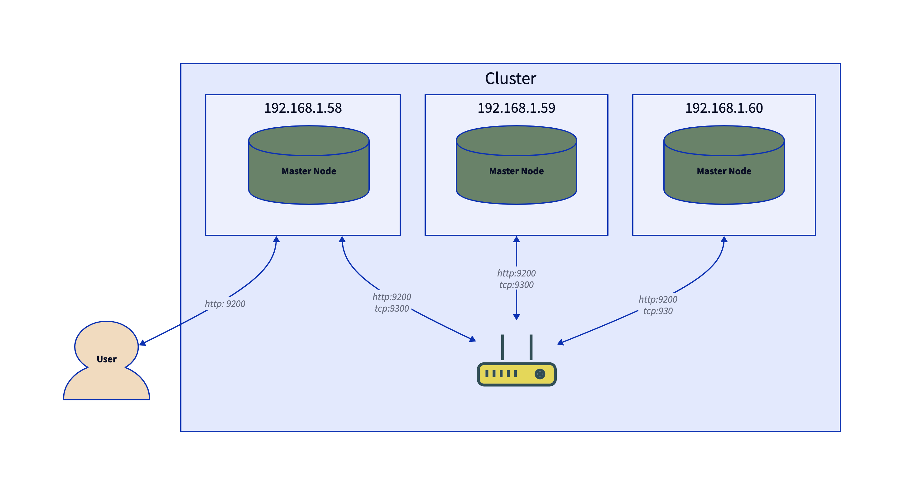

## Host Setup

- 192.168.1.58 ~ 60 (Node 3개)
    - Ubuntu 20.04.5
    - Elasticsearch 7.17.8
    - 2GB RAM
    - 2 vCPUs

## 1. Introduction

Elasticsearch를 사용하는 가장 큰 이유는 **분산형 아키텍처를 통해 대량의 데이터를 거의 실시간으로 검색 또는 적재가** 가능하기 때문입니다. 그리고 이를 가능하게 하는게 바로 **노드 바인딩을 통한 클러스터링** 입니다.

Elasticsearch에서 **노드는 클러스터를 구성하는 개별 인스턴스**로, 각각 특정 목적을 가진 여러 유형의 노드가 있습니다:

1. **Master Node**: 마스터 노드는 노드 추가 및 제거, 클러스터 상태 유지 관리, 노드에 샤드 할당 등 클러스터 관리를 담당합니다. 클러스터의 고가용성과 안정성을 위해 여러(3개 이상의 홀수) 개의 마스터 노드가 있어야 합니다.
2. **Data Node**: 데이터 노드는 데이터를 저장하고 데이터 인덱싱, 검색, 집계와 같은 데이터 관련 작업을 수행합니다. 데이터 노드는 샤드와 샤드의 복제본을 보관하는 역할을 하며, 클러스터를 확장하기 위해 필요에 따라 추가하거나 제거할 수 있습니다.
3. **Client Node**: 클라이언트 노드는 데이터 노드의 프록시 역할을 하며, 클라이언트 요청을 적절한 데이터 노드로 전달하고 결과를 반환합니다. 클라이언트 노드는 데이터 노드의 요청을 오프로드하여 성능을 개선하는 데 사용되며, 자체적으로 데이터를 저장하지 않습니다.
4. **Ingest Node**: 인제스트 노드는 Elasticsearch로 인덱싱 되기 전에 데이터를 전처리하는 데 사용됩니다. 데이터 변환 및 보강과 같은 작업을 수행할 수 있으며, 로그 분석을 위해 Logstash와 함께 사용되는 경우가 많습니다.
5. **Coordinating nodes**: 코디네이팅 노드는 클라이언트 요청을 적절한 데이터 노드로 라우팅하고 클러스터 전체에서 샤드 할당을 관리하는 데 사용됩니다. 코디네이팅 노드는 데이터를 직접 저장하지는 않지만, 어떤 데이터 노드가 어떤 샤드와 복제본을 보유하고 있는지 추적하는 역할을 담당합니다.

이번 포스팅에서는 가장 단순한 구조인 마스터 노드만으로 구성된 클러스터를 구성하는 방법에 대해 정리하겠습니다.

## 2. Clustering Nodes

클러스터에 참여하는 모든 노드들은 네트워크를 통해 서로 통신할 수 있는 환경이어야 합니다.

만약 여러개의 노드가 단일 서버 내에 구성되어 있다면 별도의 네트워크 설정을 하지 않아도 되지만 일반적으로 서비스 안정화를 위해 **하나의 물리 서버당 하나의 노드를 실행하는 것을 권장**합니다. 

그렇기 때문에 저는 내부 IP 58~60번에 각각 Node를 아래와 같이 설치해 네트워크를 구성했습니다.



### 2.1 Configure Network Settings

Elasticsearch의 클러스터 네트워크를 구성하기 위해서는 아래의 설정들이 필수적으로 적용되어야 합니다.

- **network.host**: 서버의 IP 주소입니다. IP 주소를 직접 명시해도 되지만 이미 정의된 [Special Value](https://www.elastic.co/guide/en/elasticsearch/reference/7.17/modules-network.html#network-interface-values)로 작성하면 시스템의 IP를 자동으로 맵핑해 편리하게 적용할 수 있습니다.
    - `_local_`: 기본 루프백 주소 (예: 127.0.0.1) [Default]
    - `_site_`: 내부 IP 주소 (예: 192.168.0.1)
    - `_global_`: 외부 IP 주소 (예: 8.8.8.8)
- **discovery.seed_hosts**: 클러스터에 참여하는 모든 원격 노드의 IP 또는 DNS 목록 입니다. IP 주소만 적는 경우 디폴트로 9300~9305 사이의 포트값을 검색하며, tcp 포트가 이 범위 밖에 설정 된 경우 포트번호 까지 같이 적어주어야 합니다. 자세한 내용은 [discovery.seed_hosts](https://www.elastic.co/guide/en/elasticsearch/reference/7.17/important-settings.html#unicast.hosts)를 참고합니다.
- **cluster.initial_master_nodes**: 클러스터가 최초 실행 될 때 마스터 적격 노드를 찾는 설정으로, 마스터 노드와 마스터 후보 노드들의 이름으로 명시합니다. 자세한 내용은 [Bootstrapping a cluster](https://www.elastic.co/guide/en/elasticsearch/reference/7.17/modules-discovery-bootstrap-cluster.html#modules-discovery-bootstrap-cluster)를 참고해 주세요.

노드 3개가 모두 마스터 노드이면서 데이터 노드 역할을 하기 때문에 `node.name`을 제외한 다른 설정은 모두 동일하게 적용합니다.

```yaml
# Node1

cluster.name: cluster-1
node.name: node-1

network.host: ["_local_", "_site_"]

discovery.seed_hosts: ["192.168.1.58", "192.168.1.59", "192.168.1.60"]
cluster.initial_master_nodes: ["node-1", "node-2", "node-3"]
```

```yaml
# Node2

cluster.name: cluster-1
node.name: node-2

network.host: ["_local_", "_site_"]

discovery.seed_hosts: ["192.168.1.58", "192.168.1.59", "192.168.1.60"]
cluster.initial_master_nodes: ["node-1", "node-2", "node-3"]
```

```yaml
# Node3

cluster.name: cluster-1
node.name: node-3

network.host: ["_local_", "_site_"]

discovery.seed_hosts: ["192.168.1.58", "192.168.1.59", "192.168.1.60"]
cluster.initial_master_nodes: ["node-1", "node-2", "node-3"]
```

### 2.2 Node Health Check

노드의 상태를 체크하는 `/_cat/health`에 요청하면 노드의 상태를 확인할 수 있습니다.

```bash
$ curl 192.168.1.58:9200/_cat/health
1676280449 09:27:29 cluster-1 green 2 2 40 20 0 0 0 0 - 100.0%
```

### 2.3 Cluster Health Check

클러스터의 상태를 체크하는 `/_cluster/health` 를 통해 클러스터의 상태를 확인할 수 있습니다.

```bash
$ curl 192.168.1.58:9200/_cluster/health?pretty
{
  "cluster_name" : "cluster-1",
  "status" : "green",
  "timed_out" : false,
  "number_of_nodes" : 3,
  "number_of_data_nodes" : 3,
  "active_primary_shards" : 30,
  "active_shards" : 60,
  "relocating_shards" : 0,
  "initializing_shards" : 0,
  "unassigned_shards" : 0,
  "delayed_unassigned_shards" : 0,
  "number_of_pending_tasks" : 0,
  "number_of_in_flight_fetch" : 0,
  "task_max_waiting_in_queue_millis" : 0,
  "active_shards_percent_as_number" : 100.0
}
```

## 3. Conclusion

이번 포스팅에서는 아주 단순한 구조의 Elasticsearch 클러스터를 구성하는 방법에 대해 정리해 보았습니다.

실제 운영 환경에서는 마스터 노드의 갯수부터 인덱스와 샤드 분리, 노드 역할 분리 등 추가로 적용해야 할 설정들이 아주 많습니다.

운영환경에서의 설정에 대해서는 앞으로의 포스팅에서 하나하나 정리해보도록 하겠습니다.